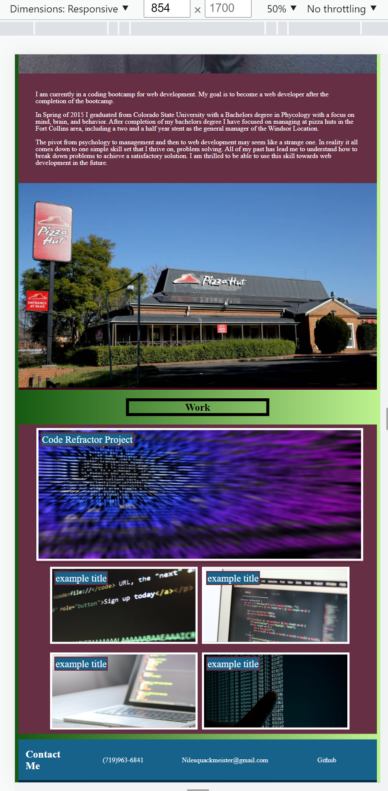
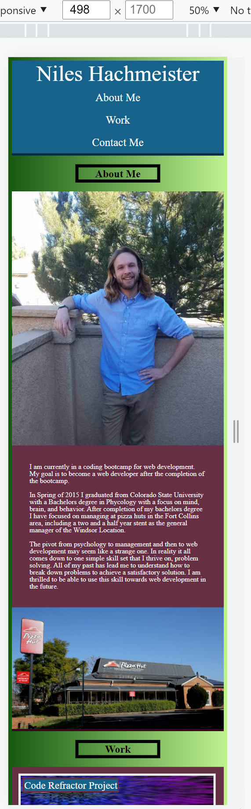

# week2homework

About the project: The goal of this page was to inform people about my work. In the header there is a navigation section to allow people to jump to different parts of the page. Below that there is an about me section where I write a little bit about myself. This section also contains a picture of me. Below that there are pictures that link to my work. Currently there is only one project that works and the rest are placeholders. At the bottom of the page there is a contact me section. This links to different ways that potential employers would be able to contact me. 
Part of the focus on the project was to demonstrate my mastery of HTML and CSS. This includes the way in which the page changes based on the view port. I also wanted to add effects on hover to give the page a more lively feel. While I think it demonstrates my mastery of these languages I am also aware that it demonstrates my lack of artistic ability.

Built Using: HTML CSS This page was built with accessibility as a main focus

Usage: The only thing the user will need to do is to open the webpage. The user will be able to use the nav section to navigate throughout the page. The user will also be able to click on the pictures of my work to navigate to webpages containing my work. At the bottom of the page the user is able to click on the contact me links to open up different interfaces to contact me.

Images:

below is an example of what the spage should look like if the width of the viewport was greater than 998px

below demonstrates the hover effect on links in the footer and header

below is an image demostrating the hover effect on the example images

below is an example image of how the example images flex down when the viewport is between 640px and 998px

below is an example image of what the top of the page should look like when the viewport is less than 640px

below is an example image of what the bottom of the page should look like when the viewport is less than 640px

sources:
I got all of my stock photos for the example programs from here:
https://www.pexels.com/search/programming/

I got the picture of pizza hut from the link bellow:
https://www.hawkesburygazette.com.au/story/6855771/all-you-can-eat-still-available-at-pizza-hut-with-a-twist/

